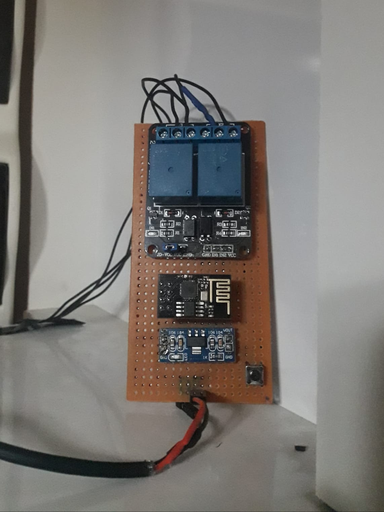

># Wiring diagram
>

### Materials;
- ESP8266 Wifi Serial Module
- 5v 2 Channel Relay Module
- Ams1117 3.3v Voltage Regulator Module
- 5x10 Perforated Pertinax
- 2x4 Pin Header Female
- 4 Pin Tact Switch - 6x6x6.5mm

### The goal of the project;
- Thanks to the ESP8266 Wifi Serial Module, you can open the door of your apartment with a single button, wherever you are in the world.
- You can change the time intervals of the relay according to the features of the [video](https://www.audio.com.tr/product-category/goruntulu-diafon/) or [audio intercom](https://www.audio.com.tr/product-category/sesli-diafon/) device connected to your home, or you can use the relay as a single channel.
**Purpose of the code;**
- First the first channel of the relay is turned on - the intercom screen works - then the second channel of the relay is turned on and when the relays are closed **the door opens.**

### You must not forget;
- Sinric has no buttons, only buttons, which causes the following problem; Even if I turn off the relay from the software, the switch still shows up in Sinric, so you should turn on [aut off](image/auto_off.png).
- Since the relay is directly connected to the power supply, you need to connect the GND pin of the relay to the GND pin of the ESP.

**Don't know how to install software on the module?**
- Don't worry [esp01_software](https://github.com/equlibrino/esp01_software)

># Circuit board - [Trial video](https://cdn.glitch.global/d03d2042-9967-4cf1-9859-fbce716a58fe/video.mp4?v=1712860379736)
>

>  
>  
>  
>

